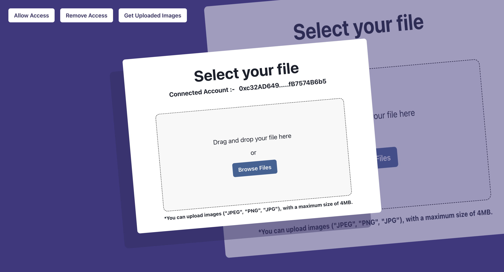

# Drive3-0: A Full-Stack Web3 DApp

## Introduction

🚀 Welcome to Drive3-0, a decentralized application (DApp) built on blockchain technology. This project combines smart contracts, decentralized storage, and user-friendly interfaces to create a unique Web3 experience.

* **Solidity**: Smart Contracts
* **Ethereum**: Sepolia testnet
* **React Vite**: Frontend Development

## Features

* **Decentralized Storage**: Upload images to Pinata IPFS
* **Access Management**: Manage access with MetaMask - grant/revoke permissions

## Live Demo

📸 Url :- https://drive3-0.web.app/

## Tech Stack

* **Solidity**: Smart Contracts
* **Ethereum**: Sepolia testnet
* **React Vite**: Frontend Development
* **Pinata IPFS**: Decentralized Storage
* **MetaMask**: Access Management
* **Firebase**: Deployment